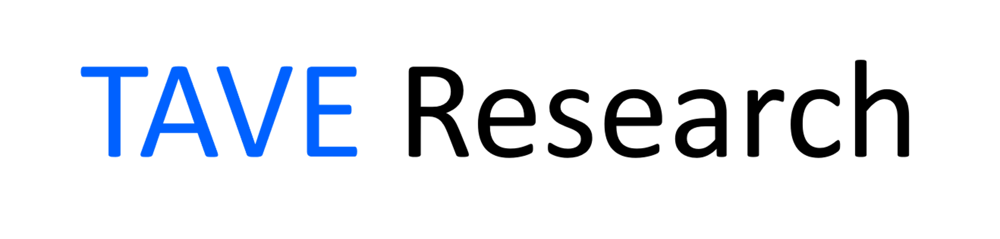
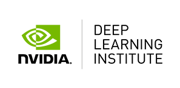

## 1. Codes

- TBA

## 2. Topics

| RMSE/MSE |  Adam/Adagrad/RMSProp  |
| :---: | :---: |
| **Softmax classifiers** |  **SGD/GD**  |
| **Cross-entropy** | **CNNs** |
| **RNNs/LSTMs** | **GANs** |
| **AutoEncoders** | **Reinforcement Learning** |
| **Natural Language Processing (basics)** | **Training, validation, and test datasets** |
| **Pooling** | **Padding** |
| **Overfitting** | **Hyperparameters** |
| **Features** | **Parameters** |
| **Activation functions** | **Transfer Learning** |
| **Frameworks** | **Image Classification** |
| **Dropout** | **Forwards and backwards propagation** |

### 1) Optimizers

- “An Overview of Gradient Descent Optimization Algorithms”: https://arxiv.org/pdf/1609.04747.pdf [✔]

- SGD optimizer (Josh Starmer): https://www.youtube.com/watch?v=vMh0zPT0tLI (Note: A little campy)

- Gradient Descent with Momentum (Andrew Ng): https://www.youtube.com/watch?v=k8fTYJPd3_I (Note: A little extra information)

- RSMProp optimizer (Andrew Ng): https://www.youtube.com/watch?v=_e-LFe_igno

- Adam optimizer (Andrew Ng): https://www.youtube.com/watch?v=JXQT_vxqwIs (Warning: Scary math ahead)

- Adagrad optimizer (minutes 5:29 - 9:19): https://www.youtube.com/watch?v=gmwxUy7NYpA

### 2) Cross Entropy

- Entropy, Cross Entropy … (Aurelien Geron): https://www.youtube.com/watch?v=ErfnhcEV1O8

### 3) Batch Normalization

- Batch Normalization in Neural Networks: https://towardsdatascience.com/batch-normalization-in-neural-networks-1ac91516821c
- Batch Norm (Andrew Ng): https://www.youtube.com/watch?v=nUUqwaxLnWs
- Batch Normalization (DeepLizard): https://www.youtube.com/watch?v=dXB-KQYkzNU

### 4) Embeddings

- Quick overview of the concept of embeddings: https://www.youtube.com/watch?v=186HUTBQnpY
- Learning embeddings in an embedding layer: https://www.youtube.com/watch?v=xtPXjvwCt64
- Embeddings developed using GloVe: https://www.youtube.com/watch?v=oUpuABKoElw

### 5) Natural Language Processing / Transformers

- “Attention Is All You Need”: https://arxiv.org/pdf/1706.03762.pdf
- “BERT: Pre-training of Deep Bidirectional Transformers for Language Understanding”: https://arxiv.org/pdf/1810.04805.pdf
- Stanford CS224N: NLP with Deep Learning – Winter 2019 – Lecture 14 – Transformers and Self-Attention: https://www.youtube.com/watch?v=5vcj8kSwBCY
-  NVIDIA’s Megatron ( https://arxiv.org/pdf/1909.08053.pdf )
- OpenAI’s GPT2 / GPT3: (Video: https://www.youtube.com/watch?v=8psgEDhT1MM ) (Paper - Language Model for Few-Shot Learners)
( https://arxiv.org/pdf/2005.14165.pdf )
- Microsoft’s Turing-NLG

## 3. Questions

### 1) 전문가랑 딥러닝의 차이
### 2) 딥러닝이 좋은 이유
### 3) 모멤텀을 사용하는이유를 왜 최적화라고 하는가
### 4) validation data를 사용하는 이유
### 5) 이미지 분류 정규화를 왜 사용하는지
### 6) CNN 분류 라벨을 왜 정숫값을 사용하지 않는지
### 7) 드롭아웃
### 8) 전이학습을 왜 사용하는지
### 9) 전이학습 파인 튜닝(freeze...)
### 10) NLP 토큰화
### 11) NLP 토큰화가 학습에 안좋은이유
### 12) NLP Embedding(Word2vec) 으로 어떻게 차원을 줄이는지
### 13) 오토 인코더가 어디에 사용되는지

     
